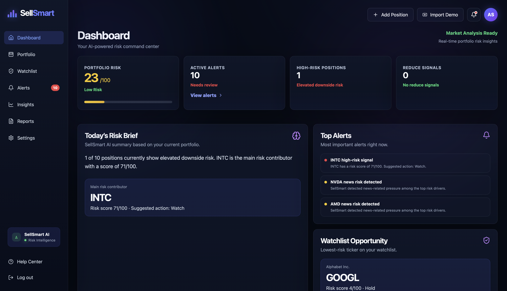
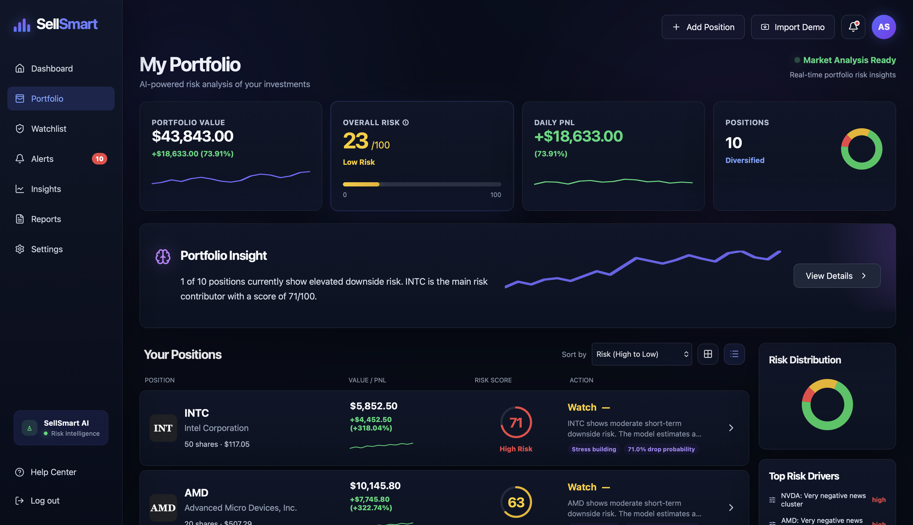
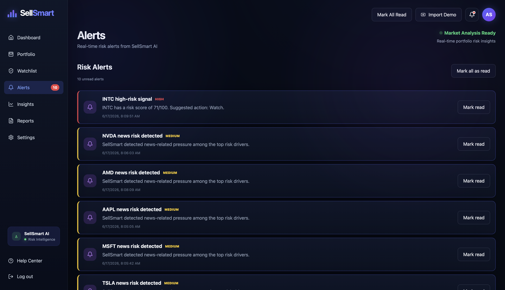
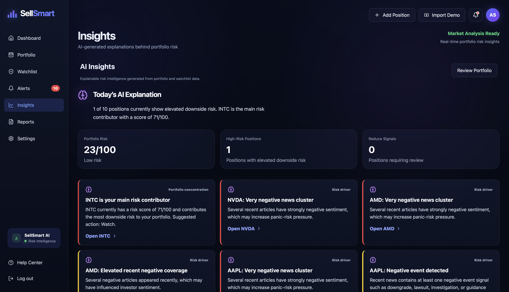
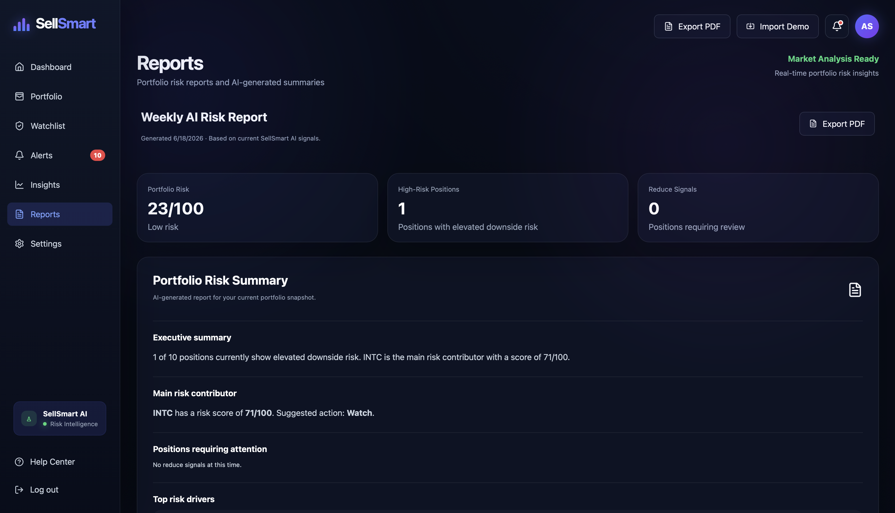
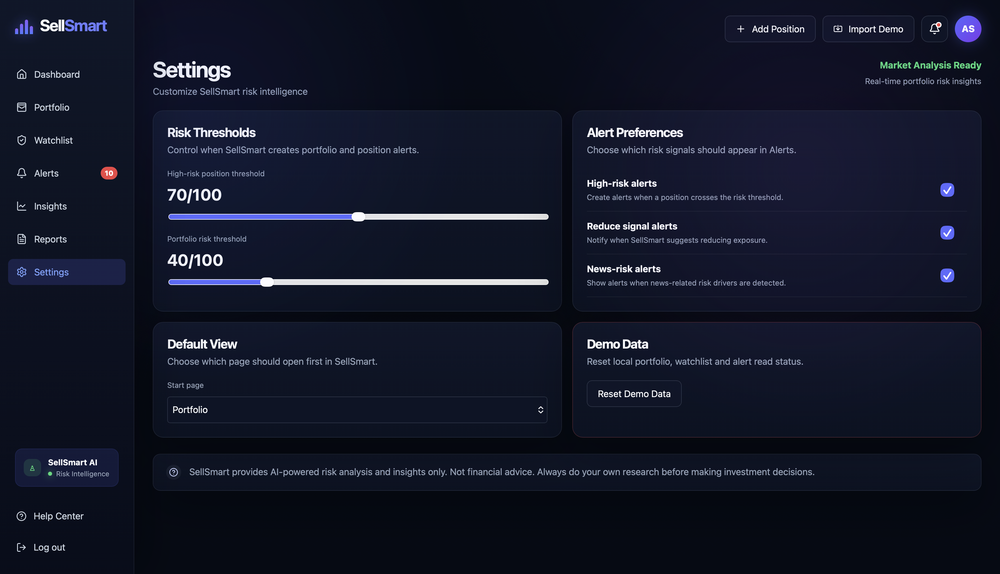

# 🚀 SellSmart UI

> AI-powered risk intelligence platform for retail investors.

SellSmart helps investors understand **when risk is increasing**, identify potential downside exposure, and receive explainable AI-powered risk insights for their portfolios and watchlists.

Unlike traditional investment tools focused on finding buying opportunities, SellSmart focuses on helping investors manage risk and make more informed decisions.

---

## 🌐 Live Demo

**Frontend:** https://sellsmart.asia

**API:** https://sellsmart-ml-api.onrender.com

---

## ✨ Features

### 📊 Dashboard

* Portfolio risk overview
* AI-generated daily risk brief
* Active alerts summary
* High-risk position monitoring
* Watchlist opportunities
* Portfolio health metrics

### 💼 Portfolio Management

* Add and manage stock positions
* Portfolio valuation tracking
* P&L monitoring
* Position-level risk analysis
* AI-generated explanations
* Grid and list views

### 👀 Watchlist

* Track stocks before investing
* AI-powered risk monitoring
* Opportunity identification
* Risk score visualization
* Action recommendations

### 🔔 Alerts System

* High-risk position alerts
* Portfolio-level risk alerts
* News-driven risk alerts
* Reduce-exposure recommendations
* Read/unread tracking

### 🧠 AI Insights

* Explainable AI analysis
* Risk driver identification
* Portfolio concentration insights
* Market sentiment interpretation
* Opportunity detection

### 📄 Reports

* Portfolio risk summaries
* AI-generated executive reports
* Risk driver analysis
* PDF export

### ⚙️ Settings

* Risk threshold customization
* Alert preferences
* Default landing page
* Demo data reset

---

# 🖼 Screenshots

## Dashboard

Your AI-powered risk command center with portfolio risk overview, alerts, and watchlist opportunities.



---

## Portfolio

Portfolio valuation, risk scoring, AI-generated insights, and position-level analysis.



---

## Alerts

Real-time risk alerts generated from portfolio signals, news sentiment, and AI risk analysis.



---

## Insights

Explainable AI intelligence showing portfolio concentration risks, news-driven signals, and risk drivers.



---

## Reports

AI-generated portfolio risk reports with executive summaries and exportable PDF support.



---

## Settings

Customize risk thresholds, alert preferences, and application behavior.



---

## 🏗 Architecture

```text
src/
├── api/
│   └── predictions.ts
│
├── components/
│   ├── AssetComponents.tsx
│   ├── Charts.tsx
│   └── AddModals.tsx
│
├── hooks/
│   ├── useSellSmartData.ts
│   ├── usePortfolioAnalytics.ts
│   ├── useAlerts.ts
│   ├── useInsights.ts
│   ├── useAssetSorting.ts
│   └── usePageHeader.ts
│
├── layout/
│   ├── AppShell.tsx
│   └── AppShell.css
│
├── pages/
│   ├── DashboardPage.tsx
│   ├── PortfolioPage.tsx
│   ├── WatchlistPage.tsx
│   ├── AlertsPage.tsx
│   ├── InsightsPage.tsx
│   ├── ReportsPage.tsx
│   ├── SettingsPage.tsx
│   └── HelpCenterPage.tsx
│
├── data/
│   └── demoData.ts
│
├── utils/
│   ├── format.ts
│   ├── risk.ts
│   └── reportPdf.ts
│
├── config.ts
├── types.ts
└── main.tsx
```

---

## 🛠 Technology Stack

### Frontend

* React
* TypeScript
* Vite

### UI & UX

* Lucide React
* Custom CSS
* Responsive Layout
* Dark Theme

### Backend Integration

* SellSmart Risk API
* REST API
* JSON Data Exchange

### Reporting

* jsPDF
* html2canvas

### Hosting

* Vercel (Frontend)
* Render (API)

---

## 🚀 Getting Started

### Clone Repository

```bash
git clone https://github.com/Illania/sellsmart-ui.git

cd sellsmart-ui
```

### Install Dependencies

```bash
npm install
```

### Run Development Server

```bash
npm run dev
```

Application will be available at:

```text
http://localhost:5173
```

---

## 🏭 Production Build

Build production assets:

```bash
npm run build
```

Preview production build:

```bash
npm run preview
```

---

## 🔧 Environment Variables

Create a `.env` file:

```env
VITE_API_URL=https://sellsmart-ml-api.onrender.com
```

Example:

```typescript
const API_BASE_URL =
  import.meta.env.VITE_API_URL ??
  "https://sellsmart-ml-api.onrender.com";
```

---

## 🤖 SellSmart AI Risk Engine

The frontend consumes predictions generated by the SellSmart machine learning platform.

### Model Output

```json
{
  "ticker": "NVDA",
  "risk_score": 78,
  "category": "high",
  "action": "Reduce",
  "confidence": "high",
  "summary": "Elevated downside risk detected.",
  "drivers": []
}
```

### Risk Categories

| Risk Score | Category      |
| ---------- | ------------- |
| 0–39       | Low Risk      |
| 40–69      | Moderate Risk |
| 70–100     | High Risk     |

### Suggested Actions

| Action | Meaning                         |
| ------ | ------------------------------- |
| Hold   | Risk remains controlled         |
| Watch  | Monitor closely                 |
| Reduce | Elevated downside risk detected |

---

## 📡 API Integration

### Health Check

```http
GET /health
```

Response:

```json
{
  "status": "ok"
}
```

### Get Prediction

```http
GET /predict?ticker=NVDA
```

Response:

```json
{
  "ticker": "NVDA",
  "risk_score": 78,
  "action": "Reduce"
}
```

---

## 🎯 Project Vision

Most investing platforms focus on helping investors answer:

> "What should I buy?"

SellSmart focuses on a different question:

> "When should I reduce risk?"

By combining:

* Market data
* Technical indicators
* News sentiment
* Machine learning

SellSmart provides explainable downside-risk intelligence for retail investors.

---

## 🗺 Roadmap

### ✅ Completed

* Portfolio management
* Watchlist management
* Risk scoring
* AI insights
* Alerts system
* PDF reporting
* Settings management
* Responsive UI
* Live API integration

### 🚧 In Progress

* Supabase integration
* User accounts
* Cloud portfolio storage

### 🔮 Planned

* Broker integrations
* Historical risk trends
* Push notifications
* Mobile application
* Portfolio import tools
* Multi-portfolio support
* AI portfolio assistant

---

## ⚠ Disclaimer

SellSmart provides AI-powered risk analysis and decision-support insights only.

Nothing on this platform constitutes investment advice, financial advice, or a recommendation to buy or sell any security.

Always conduct your own research before making investment decisions.

---

## 👩‍💻 Author

**Anna Gulich**

Software Engineer • Machine Learning Engineer • Founder

* Website: https://sellsmart.asia
* GitHub: https://github.com/Illania
* Email: [sellsmart.asia@gmail.com](mailto:sellsmart.asia@gmail.com)

---

## 📄 License

This project is provided for educational and demonstration purposes.

All rights reserved.
